```{r setup, include=FALSE}
options(htmltools.dir.version = FALSE)
knitr::opts_chunk$set(echo = TRUE, warning = FALSE)
setwd("C:/Users/Yi/Dropbox/newtermphd/Term12/Rworkshop_data_manipulation/slide") 
```

class: inverse, center, middle

# Data Analysis

---
# Workflow

```{r, echo=FALSE, out.width = '80%'}
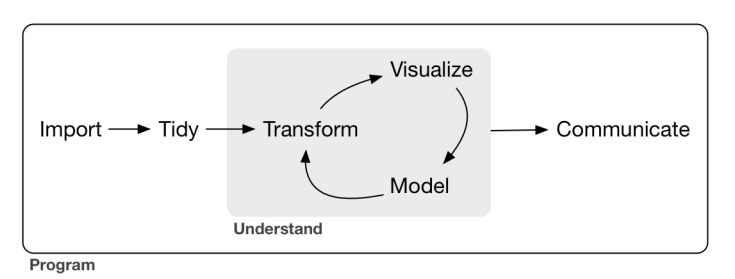
```

---

# tidyverse
```{r}
library(tidyverse)
```

---
# tidyverse - The Book
.large[
.pull-left[
- Overview of data sciences with tidyverse.
- Written by the author of tidyverse!
- Free Ebook online.
]
]

.pull-right[
```{r, echo=FALSE, out.width="70%"}
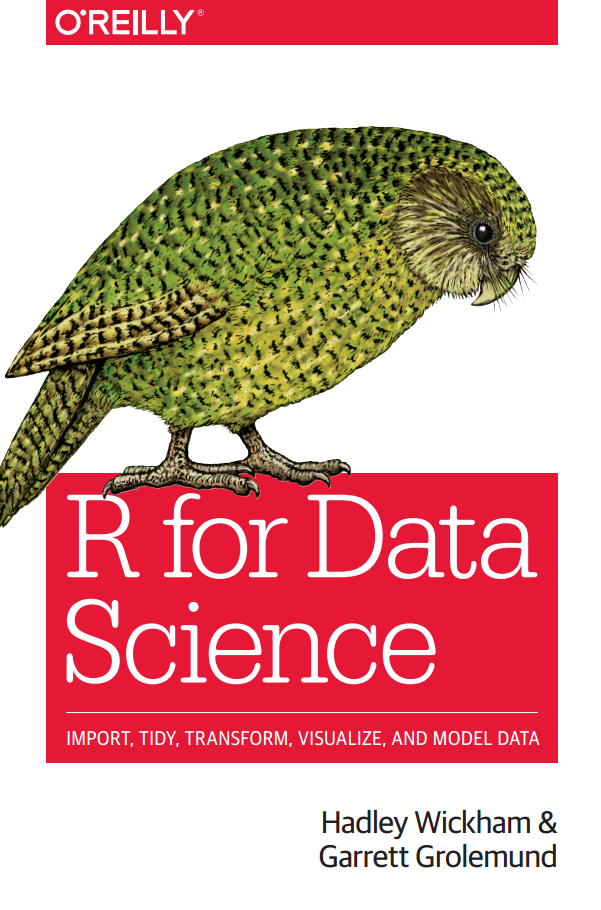
```
]

---
# tidyverse - The Cheatsheet
```{r, echo=FALSE, out.width='50%'}
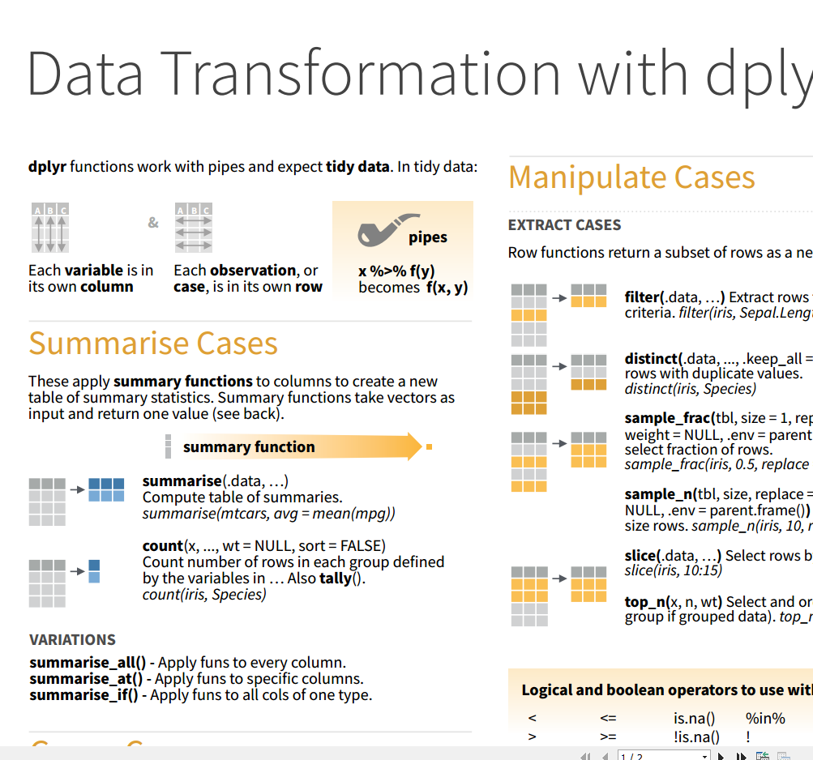
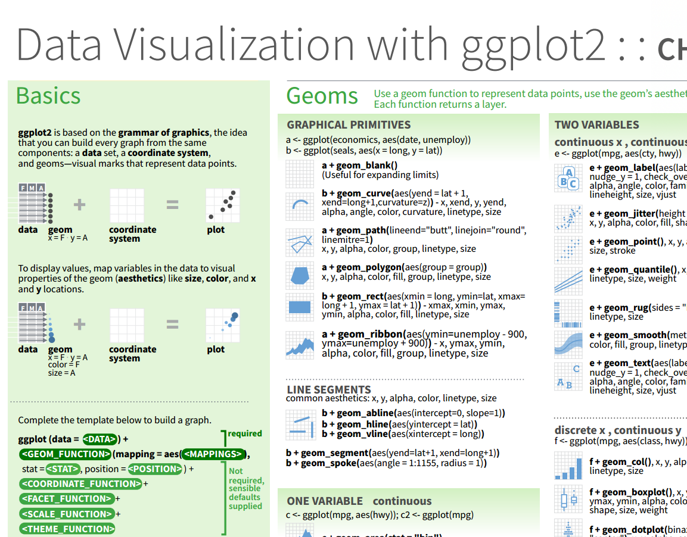
```

---
# Iris data

This famous (Fisher's or Anderson's) iris data set gives the measurements in centimeters of the variables sepal length and width and petal length and width, respectively, for 50 flowers from each of 3 species of iris.

```{r,echo=FALSE,fig.height=5}
# load data
data(iris)

iris %>% 
  ggplot(aes(x=Sepal.Length, y=Sepal.Width,
             colour = Species))+
  geom_point(size=2)+
  ggtitle("Width vs Length (Sepal)")+
  xlab("sepal length")+
  ylab("sepal width")
```

---
class: inverse, center, middle

# Data Transformation

---
#  Pipe operator
.large[
It is not a must but it makes the code more readable.
The functions in Tidyverse were designed to adapt to '%>%'.
]
```{r}
c(1,2,9,4,5,7,8) %>% mean()  
mean(c(1,2,9,4,5,7,8)) #equivalent
```

The pipe, '%>%', comes from the package 'magrittr', which is loaded
automatically by tidyverse.

---
# Why dplyr

Compared to the base R data manipulation, `dplyr` is,

.large[
- Faster.
- Simple philosophy: data frame in, data frame out.
- Syntax simplicity and ease of use.
]
---
#  Data Transformation

.large[
- as_tibble: an alternative format to data.frame. 
- glimpse: get a glimpse of your data.
- select: subset by columns (variables).
- filter: subset rows (observations) meeting one or more conditions.
- arrange: sort data by variables.
- mutate: create new variables.
- summarize: compute summary statistics of data subsets.
- group_by: divide data into groups for later operations.
]

Most of the above operations have variants with postfix `_if`, `_at`, or `_all`.

---
class: center, middle

# Iris data

.large[
See "dataTransform.Rmd" for examples.
]

---
class: inverse, center, middle

# Data Visualization

---

# ggplot2

.median[
.pull-left[
- ggplot2 is a plotting system for R.
- One of the most elegant and most versatile.
- Created by Hadley Wickham.
- Based on the `The Grammar of Graphic`.
- Do more faster by learning one sys‐
tem and applying it in many places.
]
]

.pull-right[
```{r, echo=FALSE, out.width="100%"}
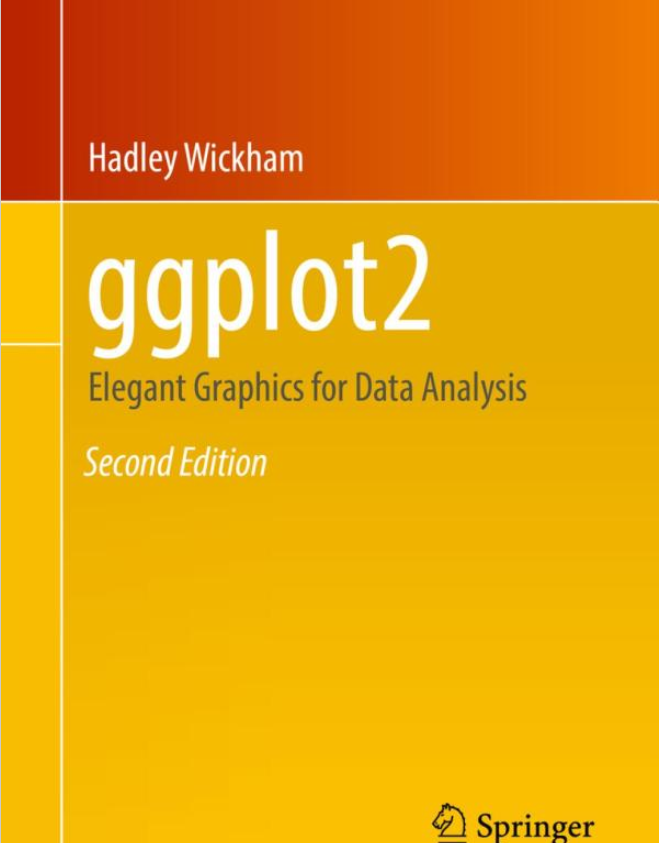
```
]


---
# Why ggplot2?
https://github.com/tidyverse/ggplot2/wiki/Why-use-ggplot2


.median[
- Automatic legends, colors, etc.
- The “default” output is much nicer than with base graphics.
- Store any ggplot2 object for modification or future recall.
- Flexibility, intuitiveness, and logic of the mapping 
between the data and its representation. 
]

---
#  ggplot2 Concepts

.pull-left[
.large[
- Data and Mapping
- Scale
- `r kableExtra::text_spec("Geom", color = "red")`etric
- `r kableExtra::text_spec("Stat", color = "red")`istics
- `r kableExtra::text_spec("Coord", color = "red")`inates
- Layer
- Facet
]
]

.pull-right[
```{r, echo=FALSE, fig.height=4,fig.align='center'}
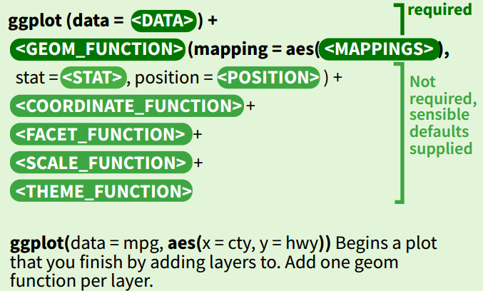
```
]

---
# Data and Mapping
.median[
Mapping controls the relationship between variables of data.
In ggplot2, we use `r kableExtra::text_spec("aes", color = "red")`thetic 
to control the mapping.
]
```{r, echo=FALSE, fig.height=3.5,fig.align='center'}
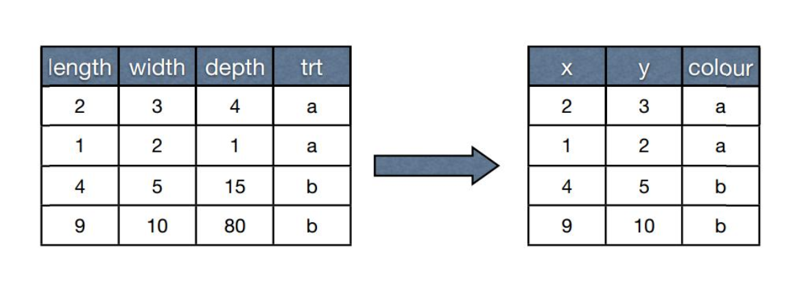
```

---
# Scale
.median[
Scale controls the format of the graphical output,
related to the mapping.
]
```{r, echo=FALSE, fig.height=3.5,fig.align='center'}
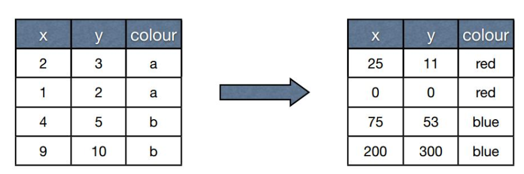
```

---
# `r kableExtra::text_spec("Geom", color = "red")`etric
.median[
Graphical objects on the plots, e.g., points, lines, polygons.
]
```{r, echo=FALSE, fig.height=3.5,fig.align='center'}
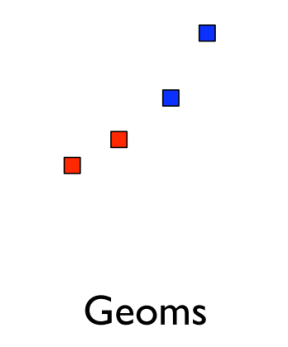
```


---
# `r kableExtra::text_spec("Stat", color = "red")`istics
.median[
Compute quantitative values/summary statistics of the data
and add them to the graph, e.g., the linear regression line, the density.
]
```{r, echo=FALSE, fig.height=3.5,fig.align='center'}
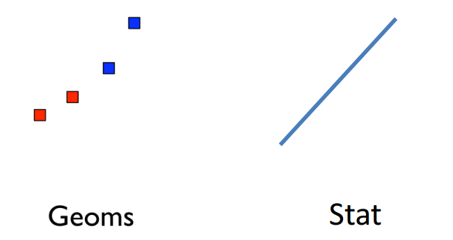
```

---
# `r kableExtra::text_spec("Coord", color = "red")`inates
.median[
The visualization perspective, e.g., a grid.
]
```{r, echo=FALSE, fig.height=3.5,fig.align='center'}
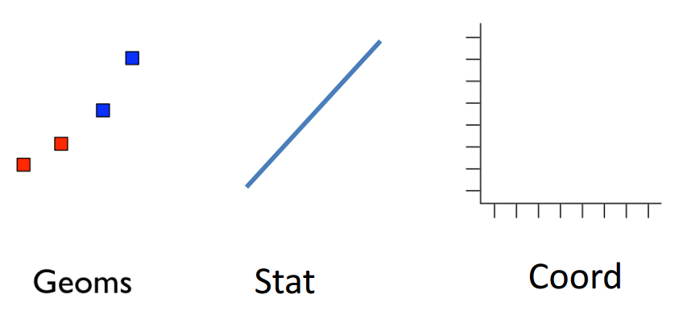
```

---
# Layer
.median[
A combination of data, mapping, geometrics, statistics and coordinates,
which can be built step by step in ggplot2.
]
```{r, echo=FALSE, fig.height=3.5,fig.align='center'}
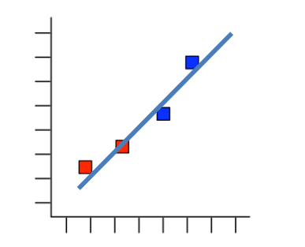
```

---
# Facet
.median[
Data are grouped by certain conditions and visualization is done for each group.
]
```{r, echo=FALSE, fig.height=3.5,fig.align='center'}
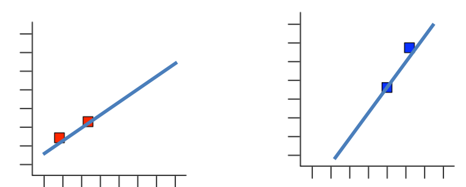
```

---

# Visualization Types
.pull-left[
.large[
- Scatterplot
- Bar chart
- Box plot
- Density/Histogram plot
- Pie chart
]
]

.pull-right[
```{r, echo=FALSE, fig.height=4,fig.align='center'}

```
]

---
class: center, middle

# Iris data

.large[
See "dataVisualize.Rmd" for examples.
]

---
class: inverse, center, middle

# Feature Engineering

---
class: inverse, center, middle

.large[
Data determine the upper limit of machine learning, 
and models just approach this upper limit.

Feature engineering helps models spend less effort in learning data.
]

---

# Feature engineering

.large[
Feature Engineering aims at creating additional relevant features 
from the existing raw features in the data,
and to increase the predictive power of the learning algorithm.
]

.large[
- Most creative aspect of Data Science.
- Hold brainstorming sessions.
- Often require domain knowledges.
- Revist previous experiences.
]

---
class: inverse, center, middle

# Data: Survival in Sinking Titanic 

---
# Survival in Sinking Titanic 

https://www.kaggle.com/c/titanic/overview

The sinking of the RMS Titanic is one of the most infamous shipwrecks in history. 
One of the reasons that the shipwreck 
led to such loss of life was that there were not enough lifeboats for the passengers and crew.
The objective of this data set is to predict which passengers survived the tragedy.

```{r, include=FALSE}
train <- read_csv("train.csv")
```

```{r, echo=FALSE}
train %>% glimpse()
```

---
# Survival in Sinking Titanic 

<style type="text/css">
.tg  {border-collapse:collapse;border-spacing:0;}
.tg td{font-family:Arial, sans-serif;font-size:14px;padding:10px 5px;border-style:solid;border-width:1px;overflow:hidden;word-break:normal;border-color:black;}
.tg th{font-family:Arial, sans-serif;font-size:14px;font-weight:normal;padding:10px 5px;border-style:solid;border-width:1px;overflow:hidden;word-break:normal;border-color:black;}
.tg .tg-0pky{border-color:inherit;text-align:left;vertical-align:top}
.tg .tg-0lax{text-align:left;vertical-align:top}
</style>
<table class="tg">
  <tr>
    <th class="tg-0pky">Variable</th>
    <th class="tg-0pky">Definition</th>
    <th class="tg-0pky">Key</th>
  </tr>
  <tr>
    <td class="tg-0pky">survival</td>
    <td class="tg-0pky">Survival</td>
    <td class="tg-0pky">0 = No, 1 = Yes</td>
  </tr>
  <tr>
    <td class="tg-0pky">pclass</td>
    <td class="tg-0pky">Ticket class</td>
    <td class="tg-0pky">1 = 1st, 2 = 2nd, 3 = 3rd</td>
  </tr>
  <tr>
    <td class="tg-0pky">sex</td>
    <td class="tg-0pky">Sex</td>
    <td class="tg-0pky"></td>
  </tr>
  <tr>
    <td class="tg-0lax">Age</td>
    <td class="tg-0lax">Age in years</td>
    <td class="tg-0lax"></td>
  </tr>
  <tr>
    <td class="tg-0lax">sibsp</td>
    <td class="tg-0lax"># of siblings / spouses aboard the Titanic</td>
    <td class="tg-0lax"></td>
  </tr>
  <tr>
    <td class="tg-0lax">parch</td>
    <td class="tg-0lax"># of parents / children aboard the Titanic</td>
    <td class="tg-0lax"></td>
  </tr>
  <tr>
    <td class="tg-0lax">ticket</td>
    <td class="tg-0lax">Ticket number</td>
    <td class="tg-0lax"></td>
  </tr>
  <tr>
    <td class="tg-0lax">fare</td>
    <td class="tg-0lax">Passenger fare</td>
    <td class="tg-0lax"></td>
  </tr>
  <tr>
    <td class="tg-0lax">cabin</td>
    <td class="tg-0lax">Cabin number</td>
    <td class="tg-0lax"></td>
  </tr>
  <tr>
    <td class="tg-0lax">embarked</td>
    <td class="tg-0lax">Port of Embarkation</td>
    <td class="tg-0lax">C = Cherbourg, Q = Queenstown, S = Southampton</td>
  </tr>
</table>

---
# Missing rate

```{r}
# Count by summarize_all
train %>%
  summarize_all(list(~sum(is.na(.))/n())) %>%
  gather(key = "variable",value="missingRate")
```

---

# Countinuous/numerical variable

.large[
- Binning/discretization, e.g., divide age into categories of children, adult, senior;
- Standarization/Normalization, important in training a neural network;
- Log, minmax transformation, ...
]

---

# Binning/discretization

.large[
In industry, continuous variables are always discretized first when fitting a logistic regression or a linear regression. 

- Improve interpretation sometimes;
- Discretized variables is less sensitive to outliers;
- Discretizing produces more categories/variables and enhances the non-linearity/representation power of the linear model;
- Allow to add more interactions from discretized variables.
]

---
# Discretize Age

To discretize a continuous variable in R, we use the function `cut`.

```{r}
summary(train$Age)
train <- train %>%
  mutate(age_bin=cut(Age, breaks = c(0,18,60,80),
                     labels=c("children","adult","senior"),
                     include.lowest = TRUE)) %>%
  mutate(age_bin=addNA(age_bin)) 
train %>% select(Age,age_bin) %>% print(n=2)

# Categories with NA (not available, i.e., missing values) added
levels(train$age_bin)
```

---

# Categorical variable

.large[
- Always appear in practice.
- High cardinality can create very sparse data.
- Difficult to impute missing.
]


---

# Encoding
.median[
Mathematical models can not treat categorical variables directly.
Instead, categorical variables are encoded before they are passed to the model.
Encoding here means that we use some numerical variables to represent a categorical variable.
]

https://www.slideshare.net/HJvanVeen/feature-engineering-72376750

.large[
- One Hot Encoding (Dummy variables)
- Hash encoding
- Label encoding
- Count encoding
- Target encoding
- Category Embedding
- NaN encoding
]

---

# One-hot encoding
.median[
It is also called dummy variables. 
For example, to represent the ticket class `Pclass`, 
which has three levels, 1,2,3, 
we can create two dummy variables.
]

```{r}
model.matrix(~factor(Pclass),data=train) %>% 
  head()
```


---

# One-hot encoding

.median[
- Most basic method without information loss.
- Sparse format is memory-friendly
- Most current implementations don’t gracefully treat
missing, unseen variables 
]

---

# Count encoding
.median[
There are 891 obervations in this Titanic data set 
but only 681 unique tikets.
So there were passengers with the same ticket.
We can then use the number of passengers for each ticket
to represent each ticket.
]

```{r}
train %>% 
  group_by(Ticket) %>%
  summarise(shareTicket=n()) %>% 
  right_join(train, by ="Ticket") %>%
  select(Ticket,shareTicket) %>%
  print(n=4)
```

---
# Count encoding
.median[
In essense, it means that the frequency of a level for a factor
is related to the quantity of interest.
]

.median[
- Replace categorical variables with their count in the
training set.
- Suitable when a variable has many levels even some of them is rare.
- Useful for both linear and non-linear algorithms.
- Can be sensitive to outliers.
- May add log-transform, works well with counts.
- Replace unseen variables with `1`.
- May give collisions: same encoding, different variables.
]

---

# Target encoding

.median[
Encode categorical variables by their ratio of target (binary
classification or regression).

- Be careful to avoid overfit! (Leakage)
- Form of stacking: single-variable model which outputs average target.
- Do in cross-validation manner
- Add random noise to combat overfit
- Suitable when a variable has many levels but each of them is not rare.
]

---

# Target encoding

```{r}
reftable <- train %>% 
  group_by(Pclass) %>%
  summarise(surPclass=mean(Survived)) 
reftable

reftable %>%
  right_join(train, by ="Pclass") %>%
  select(Pclass,surPclass) %>%
  mutate(surPclass=surPclass+rnorm(nrow(train),sd=0.01)) %>%  # add noise
  print(n=4)
```

---
class: center, middle

# Exercise

.large[
See "Titanic_working.Rmd".
]

---
class: center, middle

# Thank You!
<!-- Feedback Link: -->

<!-- https://forms.gle/dbyUnk5SF9UkgkcBA -->


